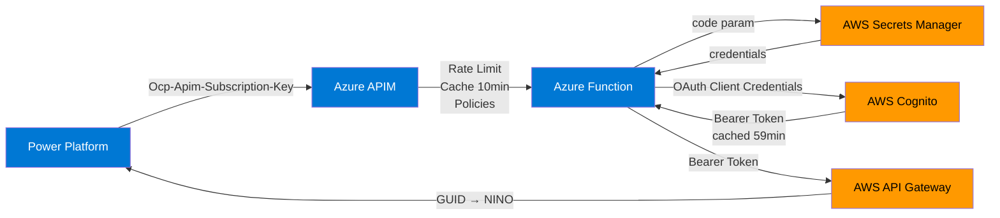
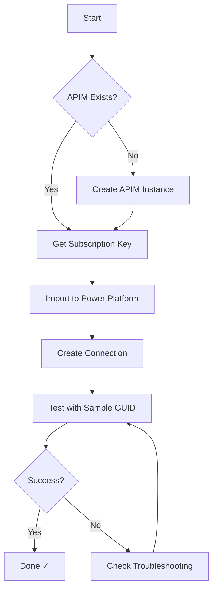
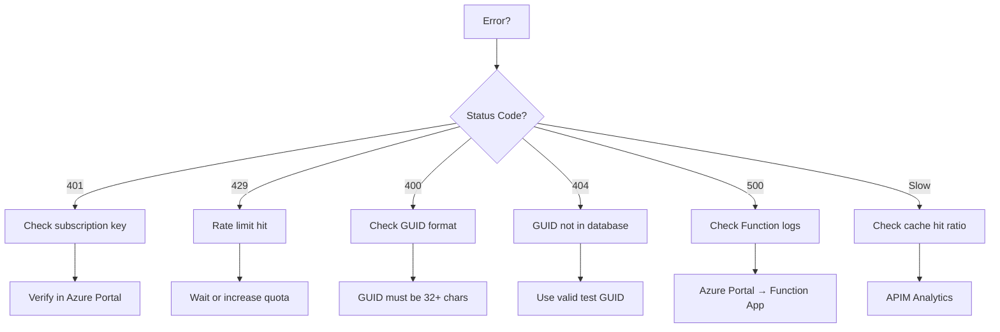
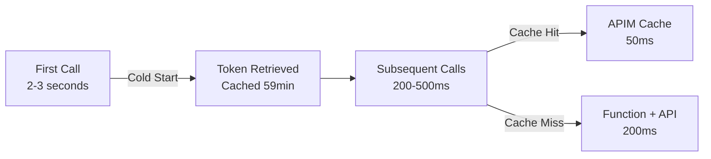
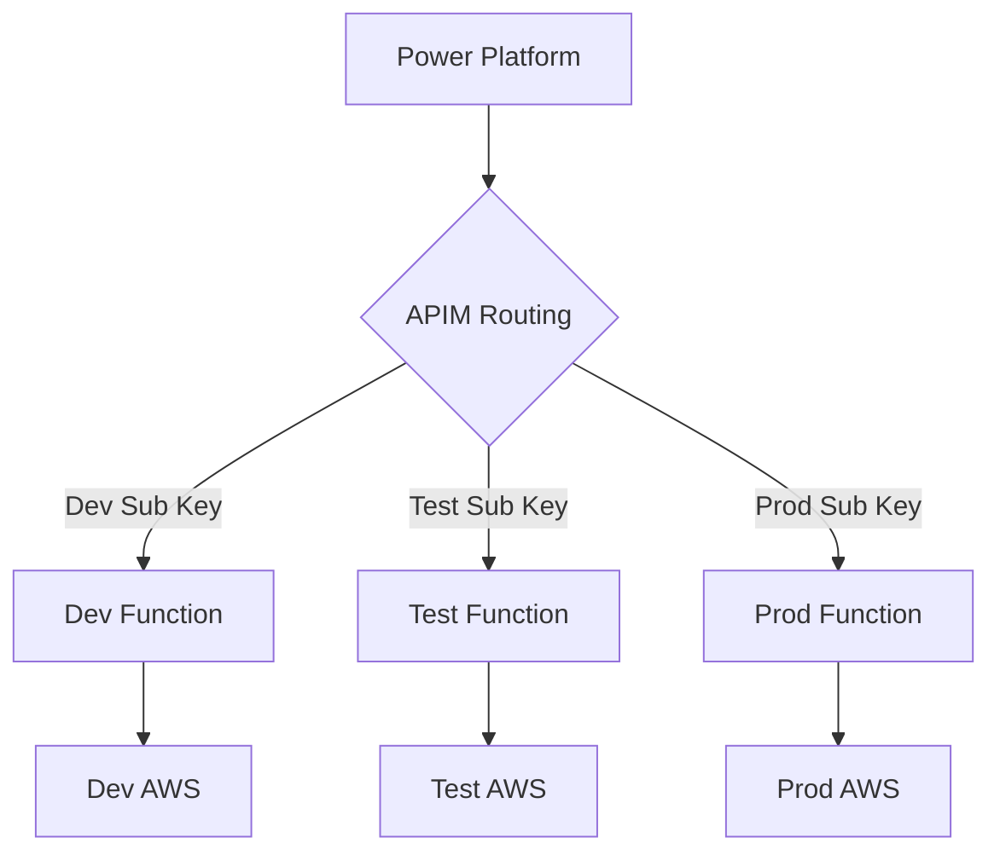
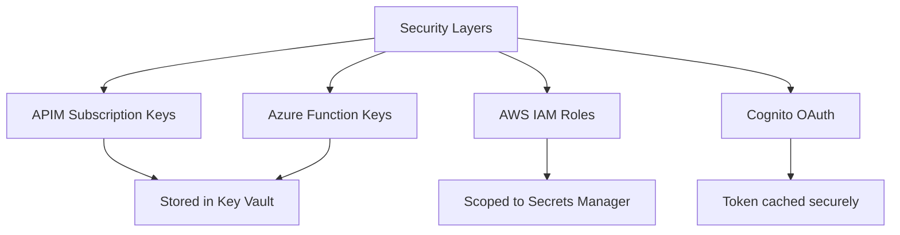
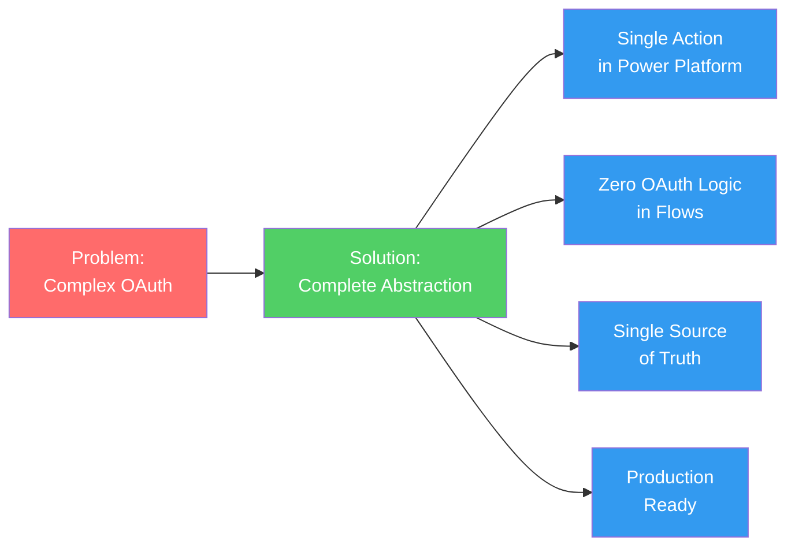

# Cross-Cloud OAuth Abstraction - AtW GUID Service

Complete OAuth abstraction for Power Platform accessing AWS services via Azure API Management.

## Architecture Overview



## Component Reference

### Azure API Management
```yaml
Name: vpn-lab-apim-guid
Gateway: https://vpn-lab-apim-guid.azure-api.net
Path: /guid/GetGUID
Method: POST
Subscription Key: [Stored in Azure Key Vault: azure-apim-subscription-key]
```

**Test Request:**
```bash
curl -X POST https://vpn-lab-apim-guid.azure-api.net/guid/GetGUID \
  -H "Ocp-Apim-Subscription-Key: YOUR_KEY" \
  -H "Content-Type: application/json" \
  -d '{"guid":"123e4567-e89b-12d3-a456-426614174000"}'
```

### Azure Function
```yaml
Name: vpn-lab-aws-bridge-5295
URL: https://vpn-lab-aws-bridge-5295.azurewebsites.net/api/GetGUID
Function Key: [Stored in Azure Key Vault: azure-function-key]
Runtime: Python 3.11

Environment Variables:
  GUID_API_URL: https://z3euh2qc03.execute-api.eu-west-2.amazonaws.com/test
  COGNITO_DOMAIN: vpn-lab-1762372102.auth.eu-west-2.amazoncognito.com
  AWS_SECRET_NAME: consumer/cognito/vpn-lab/credentials
  AWS_REGION: eu-west-2
```

### AWS Secrets Manager
```yaml
Secret Name: consumer/cognito/vpn-lab/credentials
Region: eu-west-2
Format: {"client_id": "...", "secret": "..."}
```

### AWS Cognito
```yaml
Domain: vpn-lab-1762372102.auth.eu-west-2.amazoncognito.com
Token Endpoint: /oauth2/token
Grant Type: client_credentials
Token Cache: 59 minutes in Azure Function memory
```

### AWS API Gateway
```yaml
Endpoint: https://z3euh2qc03.execute-api.eu-west-2.amazonaws.com/test
Path: /nino/{guid}
Method: GET
Auth: Bearer token
```

---

## Quick Start

### Setup (One-time)



**Checklist:**
- ☐ Get APIM subscription key from Azure Portal
- ☐ Import Custom Connector to Power Platform
- ☐ Create connection with subscription key
- ☐ Test: `{"guid":"123e4567-e89b-12d3-a456-426614174000"}`
- ☐ Verify response includes `nino`, `firstName`, `lastName`

### Daily Use

**Power Automate:**
```
1. Add action: "GUID Service - Get Person Details"
2. Input: guid (from trigger or previous step)
3. Output: nino, firstName, lastName, dateOfBirth
```

**Power Apps:**
```javascript
Set(Person, GUIDServiceConnector.GetPersonDetails({
    guid: "123e4567-e89b-12d3-a456-426614174000"
}))

Label_NINO.Text = Person.nino
Label_Name.Text = Person.firstName & " " & Person.lastName
```

---

## Request/Response Examples

### Request
```json
POST https://vpn-lab-apim-guid.azure-api.net/guid/GetGUID
Headers:
  Ocp-Apim-Subscription-Key: 5fa3f9a928174205a92a56cf34f4448a
  Content-Type: application/json

Body:
{
  "guid": "123e4567-e89b-12d3-a456-426614174000"
}
```

### Response (Success)
```json
{
  "guid": "123e4567-e89b-12d3-a456-426614174000",
  "nino": "AB123456C",
  "firstName": "John",
  "lastName": "Doe",
  "dateOfBirth": "1990-01-01",
  "source": "Mock NINO Service",
  "timestamp": "2025-01-01T12:00:00Z"
}
```

### Response (Errors)
```json
// 401 - Invalid subscription key
{"statusCode": 401, "message": "Access denied due to invalid subscription key"}

// 429 - Rate limit exceeded
{"statusCode": 429, "message": "Rate limit exceeded"}

// 400 - Invalid GUID
{"error": "Invalid GUID format"}

// 404 - GUID not found
{"error": "GUID not found in GUID service"}
```

---

## Troubleshooting



**Common Issues:**

| Issue | Cause | Fix |
|-------|-------|-----|
| 401 Unauthorized | Wrong subscription key | Get key from Azure Portal → APIM → Subscriptions |
| 429 Too Many Requests | Hit rate limit (1000/hour) | Wait or increase quota in APIM policy |
| Slow response (>3s) | Cold start | First call after idle takes 2-3s (normal) |
| No response | Function not running | Check Azure Portal → Function App → Status |
| Wrong data | Cache stale | Wait 10 mins or clear APIM cache |

**Debug Commands:**

```bash
# Get subscription key
az rest --method post \
  --uri "/subscriptions/.../subscriptions/power-platform-sub/listSecrets?api-version=2021-08-01" \
  --query primaryKey -o tsv

# View Function logs
az functionapp log tail \
  --name vpn-lab-aws-bridge-5295 \
  --resource-group vpn-lab-rg

# Test Function directly (bypass APIM)
curl -X POST https://vpn-lab-aws-bridge-5295.azurewebsites.net/api/GetGUID?code=FUNCTION_KEY \
  -H "Content-Type: application/json" \
  -d '{"guid":"123e4567-e89b-12d3-a456-426614174000"}'
```

---

## Performance & Cost

### Cost Breakdown

| Component | Tier | Usage | Cost/Month |
|-----------|------|-------|------------|
| AWS Secrets Manager | Standard | 1 secret, ~1K calls | $0.40 |
| Azure Function | Consumption | ~1K executions | $0.00 (free tier) |
| Azure APIM | Consumption | ~1K calls, <1GB | $0.01 |
| **TOTAL** | | | **$0.41** |

### Performance Metrics



**Typical Response Times:**
- First call (cold start): 2-3 seconds
- Token cached, API call: 200-500ms
- APIM cache hit: <50ms

**Cache Strategy:**
- Cognito OAuth tokens: 59 minutes (Azure Function memory)
- GUID lookups: 10 minutes (APIM policy)
- Estimated cache hit rate: 70%

---

## Environment Configuration

### Multi-Environment Setup



### Environment Matrix

| Environment | APIM Subscription | Function App | GUID API URL | Secrets |
|-------------|------------------|--------------|--------------|---------|
| **Dev** | dev-subscription-key | vpn-lab-func-dev | https://dev-api.../guid | dev/credentials |
| **Test** | test-subscription-key | vpn-lab-func-test | https://test-api.../guid | test/credentials |
| **Prod** | prod-subscription-key | vpn-lab-aws-bridge-5295 | https://api.../guid | prod/credentials |

### APIM Policy for Environment Routing

```xml
<policies>
    <inbound>
        <base />
        <!-- Route based on subscription -->
        <choose>
            <when condition="@(context.Subscription.Name == "dev-subscription")">
                <set-backend-service base-url="https://vpn-lab-func-dev.azurewebsites.net/api" />
                <set-query-parameter name="code" exists-action="override">
                    <value>{{dev-function-key}}</value>
                </set-query-parameter>
            </when>
            <when condition="@(context.Subscription.Name == "test-subscription")">
                <set-backend-service base-url="https://vpn-lab-func-test.azurewebsites.net/api" />
                <set-query-parameter name="code" exists-action="override">
                    <value>{{test-function-key}}</value>
                </set-query-parameter>
            </when>
            <otherwise>
                <!-- Production (default) -->
                <set-backend-service base-url="https://vpn-lab-aws-bridge-5295.azurewebsites.net/api" />
                <set-query-parameter name="code" exists-action="override">
                    <value>{{prod-function-key}}</value>
                </set-query-parameter>
            </otherwise>
        </choose>
    </inbound>
</policies>
```

---

## APIM Policies Reference

### Current Production Policy

```xml
<policies>
    <inbound>
        <base />
        <!-- Rate limiting: 1000 calls/hour per subscription -->
        <rate-limit calls="1000" renewal-period="3600" />

        <!-- Quota: 10,000 calls/day per subscription -->
        <quota calls="10000" renewal-period="86400" />

        <!-- Cache lookup -->
        <cache-lookup vary-by-developer="false" vary-by-developer-groups="false" />

        <!-- Forward Azure Function key -->
        <set-query-parameter name="code" exists-action="override">
            <value>uWczQWcKnaQHKM_FTWXgsFlF1wxdY5mgeDMwxnF4LiscAzFuECFtFQ==</value>
        </set-query-parameter>
    </inbound>
    <backend>
        <base />
    </backend>
    <outbound>
        <base />
        <!-- Cache successful responses for 10 minutes -->
        <cache-store duration="600" />
    </outbound>
    <on-error>
        <base />
    </on-error>
</policies>
```

### Policy Modifications

**Increase Rate Limit:**
```xml
<rate-limit calls="5000" renewal-period="3600" />
```

**Adjust Cache Duration:**
```xml
<cache-store duration="1800" /> <!-- 30 minutes -->
```

**Add IP Whitelisting:**
```xml
<ip-filter action="allow">
    <address-range from="13.64.0.0" to="13.107.255.255" />
</ip-filter>
```

---

## Monitoring & Analytics

### APIM Analytics Dashboard

**Access:** Azure Portal → API Management → Analytics

**Key Metrics:**
- Total requests
- Failed requests (4xx, 5xx)
- Average response time
- Cache hit ratio
- Top consumers by subscription

### Application Insights

**Access:** Azure Portal → Function App → Application Insights

**Key Queries:**

```kusto
// Failed requests
requests
| where success == false
| summarize count() by resultCode
| order by count_ desc

// Response times
requests
| summarize avg(duration), percentile(duration, 95) by bin(timestamp, 1h)

// Cognito token cache effectiveness
traces
| where message contains "cached token"
| summarize CachedCalls = count() by bin(timestamp, 1h)
```

---

## Security Best Practices



**Key Storage:**
- APIM subscription keys → Azure Key Vault
- Azure Function keys → Azure Key Vault
- AWS credentials → Azure Function App Settings (encrypted)
- Cognito credentials → AWS Secrets Manager
- OAuth tokens → Azure Function memory (temporary, 59 min)

**Access Control:**
- APIM: Subscription-based access
- Azure Function: Function-level keys
- AWS: IAM roles with least privilege
- Power Platform: DLP policies (classify as Business data)

**Rotation Schedule:**
- APIM subscription keys: Quarterly
- Azure Function keys: Quarterly
- AWS credentials: Bi-annually
- Cognito client secrets: Annually

---

## What You've Built



**Achievements:**
- ✅ Complete OAuth abstraction (AWS Secrets Manager → Cognito → API)
- ✅ Enterprise API Management (rate limiting, caching, monitoring)
- ✅ Single source of truth for credentials
- ✅ Token caching (59-minute reuse)
- ✅ Multi-environment ready
- ✅ Production-grade security
- ✅ Cost: $0.41/month

---

## Quick Reference

### URLs
```
APIM Gateway: https://vpn-lab-apim-guid.azure-api.net
Function App: https://vpn-lab-aws-bridge-5295.azurewebsites.net
AWS API: https://z3euh2qc03.execute-api.eu-west-2.amazonaws.com/test
```

### Keys (Stored in Azure Key Vault)
```
APIM Subscription: azure-apim-subscription-key
Function Key: azure-function-key
```

### Test GUID
```
123e4567-e89b-12d3-a456-426614174000
```

### Expected Response
```json
{
  "guid": "123e4567-e89b-12d3-a456-426614174000",
  "nino": "AB123456C",
  "firstName": "John",
  "lastName": "Doe",
  "dateOfBirth": "1990-01-01"
}
```

---

**Documentation Version:** 1.0
**Last Updated:** 2025-11-06
**Status:** Production Ready ✅
