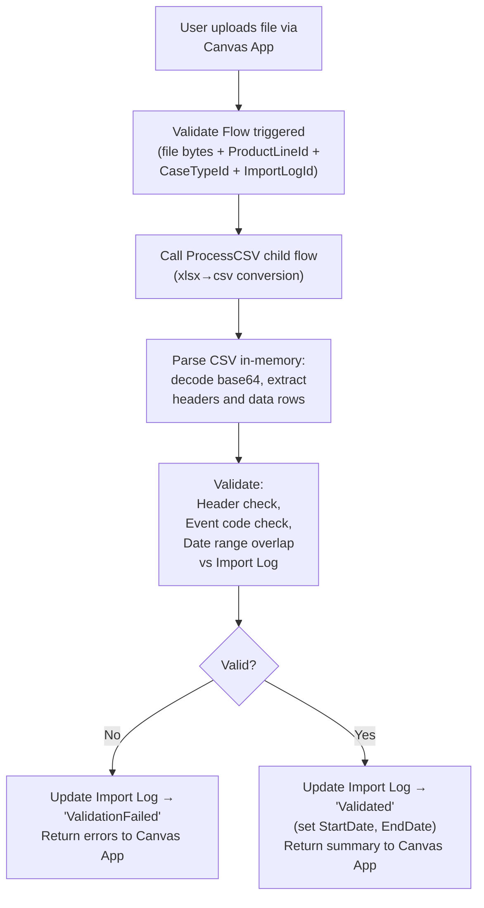
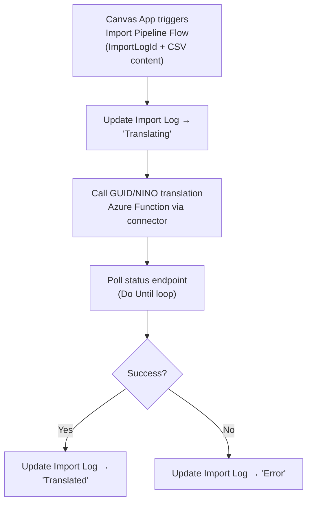
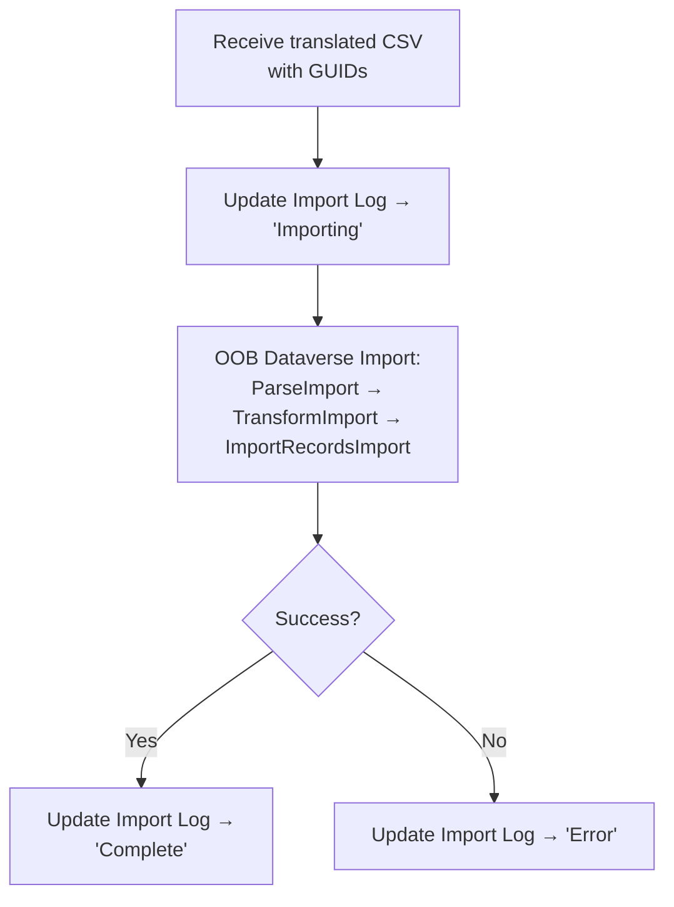
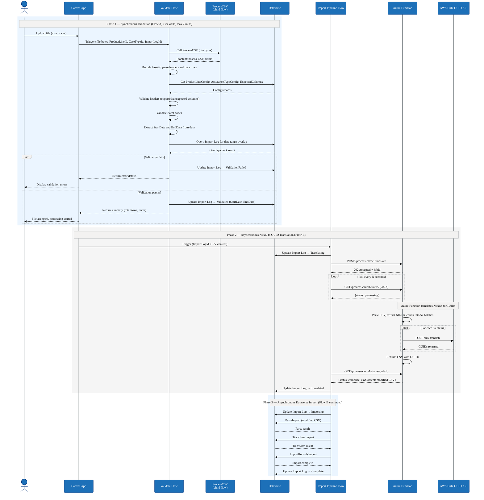
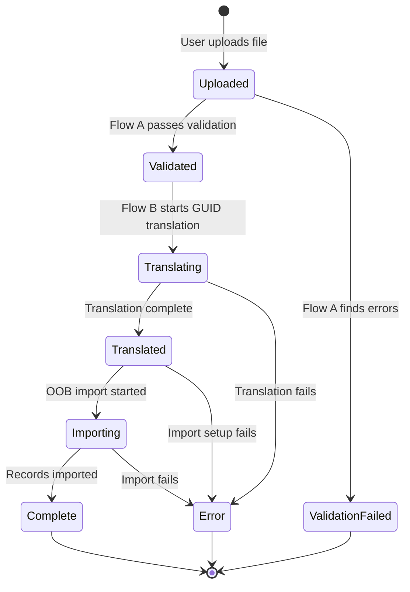

# Data Import Pipeline Adaptation Plan

**Author:** James Ryan
**Date:** 7 April 2026
**Status:** Draft

## Summary

This plan describes the adaptation of the Case Sampling data import pipeline from a SharePoint-based ETL flow to an in-memory processing model. The design splits the pipeline into two flows on the 2-minute synchronous boundary:

- **Flow A (Synchronous)** — Validate flow, modified to call ProcessCSV directly, parse CSV in-memory, validate headers/event codes/date overlap, update the Import Log, and respond to the Canvas App within 2 minutes.
- **Flow B (Asynchronous)** — A new Import Pipeline flow, triggered by the Canvas App on validation success, handling GUID/NINO translation and OOB Dataverse import with Import Log state tracking throughout.

## Phase 1: Synchronous Validation (Flow A)

## Phase 2: Asynchronous NINO to GUID Translation (Flow B)

## Phase 3: Asynchronous Dataverse Import (Flow B continued)

## Sequence Diagram

## Import Log Lifecycle

## Current State

### Working Flows (no changes needed)

| Flow | ID | Role |
|------|----|------|
| **ProcessCSV** | `B8263CFF` | Receives file bytes, converts xlsx→csv via child flow, returns base64 CSV |
| **ExcelToCSV** | `BF5E59C2` | Child of ProcessCSV — uploads xlsx to SharePoint, reads via Graph API, maps columns, returns base64 CSV |
| **ImportData** | `06002464` | OOB Dataverse import (ParseImport → TransformImport → ImportRecordsImport). Contains "Placeholder for GUID Service" |

### Flow Requiring Adaptation

| Flow | ID | Issue |
|------|----|-------|
| **Validate** | `62D02995` | Currently calls ETL Reader via SharePoint. Validates headers and event codes. Extracts dates but **never checks them against existing imports** |

### What Validate Does Today

1. Calls ETL Reader (passing ImportLogId) → receives `{headers, data, errors, file_type}`
2. Checks for parse errors from ETL Reader
3. Validates expected and unexpected column headers
4. Validates event code values (New Claim vs non-New Claim)
5. Extracts StartDate and EndDate from data — **but never validates them**

### What Is Missing

- **Date range overlap check** — query Import Log for same product line where date ranges overlap
- **In-memory input** — bypass the ETL Reader and SharePoint; accept file bytes directly
- **Async pipeline flow** — GUID/NINO translation + OOB import with Import Log state tracking

## Implementation Steps

### Phase A: Adapt Validate Flow as Sync Entry Point

> [!NOTE]
> This modifies the existing Validate flow (`62D02995`) to become the synchronous entry point for the pipeline.

**A1. Keep existing trigger** — still accepts `file` (name + contentBytes), `ProductLineId`, `CaseTypeId`, `ImportLogId` from Canvas App.

**A2. Add ProcessCSV call** at start of Try scope:
- After `Run_URL`, call ProcessCSV (`B8263CFF`) as child flow — pass `file` object
- Receive `{content, status, message, errors}`
- If errors non-empty, short-circuit to response

**A3. Parse CSV output inline** (replaces ETL Reader call):
- Decode base64 `content` to string
- Remove BOM, split by CRLF into lines
- Extract headers from first line (split by comma, trim each)
- Build data array from remaining lines
- Replace `IngestionFileHeaders` / `IngestionFileData` compose actions
- Remove `Parse_Ingestion_File` action (ETL Reader call to `8CE76635`)

**A4. Keep existing validation logic** (minimal changes):
- Header expected/unexpected column checks — no changes
- Event code checks — no changes
- Date extraction — **update**: CSV from ProcessCSV already has `yyyy-MM-dd` dates (not Excel serial numbers), so replace `addDays('1899-12-30', int(value))` with direct date parsing

**A5. Add date range overlap check** (new, after `Set_variable_EndDate`):
- Query `dwp_importlogs` with filter: `_dwp_productlineid_value eq '{ProductLineId}' and statuscode eq {completed} and dwp_startdate le '{EndDate}' and dwp_enddate ge '{StartDate}'`
- If results > 0: append `DateRangeOverlap` error to Errors array

**A6. Update Import Log** before responding:
- No errors → Update Import Log status to "Validated", set `dwp_startdate` and `dwp_enddate`
- Has errors → Update Import Log status to "ValidationFailed"

**A7. Response unchanged**: `{summary: {totalRows, errorCount, StartDate, EndDate}, errors: [...]}`

### Phase B: Create Async Import Pipeline Flow

> [!NOTE]
> This is a new flow that handles the asynchronous portion of the pipeline.

**B1. PowerAppV2 trigger** accepting:
- `ImportLogId` (string)
- `CsvContent` (string, base64-encoded CSV)
- Canvas App triggers this after receiving validation success

**B2. GUID/NINO Translation stage**:
- Update Import Log → "Translating"
- Call Azure Function via Custom Connector
- Poll for completion (Do Until loop)
- Update Import Log → "Translated"

**B3. OOB Dataverse Import stage** (reusing pattern from ImportData `06002464`):
- Update Import Log → "Importing"
- Create Data Import, Data Map, and Import File records
- **Read column mappings from OOB `columnmappings` entity** (filtered by product line) instead of hardcoded array
- Create Column Mappings from config
- `ParseImport` → poll until complete → `TransformImport` → poll until complete → `ImportRecordsImport`
- Update Import Log → "Complete"

**B4. Error handling**:
- Try/Catch/Finally pattern (consistent with all existing flows)
- On any error: Update Import Log → "Error" with error details
- Send GDS-styled error notification email

### Phase C: Update Pipeline Diagrams

- Update `data-import-pipeline-overview.mmd` to reflect the two-flow architecture
- Update `data-import-pipeline-sequence.mmd` to show separate sync and async flows with Import Log updates

## Decisions

| Decision | Rationale |
|----------|-----------|
| No separate orchestrator | Validate calls ProcessCSV directly — KISS |
| One async flow for translation + import | Avoids unnecessary flow-to-flow overhead |
| Import Log as state machine | Canvas App can poll for progress updates |
| ETL Reader bypassed, not deleted | May still be useful for other scenarios |
| Date overlap = any range overlap | Standard overlap logic: `existing.start ≤ new.end AND existing.end ≥ new.start` |
| Column mappings config-driven | Using OOB Column Mapping table. 3 product lines piloting, 26 total. Custom mapping UI needed eventually but not this pass |
| Only check completed imports for overlap | Exclude failed/error imports to avoid false positives |

## Verification

| # | Test | Expected Outcome |
|---|------|-----------------|
| 1 | Validate with xlsx file + valid config | ProcessCSV called, CSV parsed, headers validated, Import Log → Validated |
| 2 | Submit file with overlapping date range | `DateRangeOverlap` error returned, Import Log → ValidationFailed |
| 3 | Submit file with non-overlapping dates | Validation passes |
| 4 | Measure sync flow end-to-end | Completes within 2-minute budget |
| 5 | Upload .csv file (not xlsx) | ProcessCSV passes through without xlsx conversion |
| 6 | Trigger async flow after validation | Import Log progresses: Translating → Translated → Importing → Complete |
| 7 | Simulate GUID translation failure | Import Log → Error |
| 8 | Regression: existing validations | Header, column, and event code checks still produce correct errors |

## Relevant Files

| File | Action |
|------|--------|
| `Workflows/CaseSamplingValidateImportDataInstant-62D02995...json` | **Modify** — add ProcessCSV call, inline CSV parsing, date overlap check, Import Log updates |
| `Workflows/CaseSamplingProcessCSVContentForParseImport-B8263CFF...json` | No changes — called as child by Validate |
| `Workflows/CaseSamplingExceltoCSVInstant-BF5E59C2...json` | No changes — called by ProcessCSV |
| `Workflows/CaseSamplingImportData-06002464...json` | **Reference** — reuse import logic pattern in new async flow |
| `Workflows/CaseSamplingETLExcelReaderInstant-8CE76635...json` | No longer called from Validate; can be retired |
| `docs/diagrams/data-import-pipeline-overview.mmd` | **Update** to reflect two-flow architecture |
| `docs/diagrams/data-import-pipeline-sequence.mmd` | **Update** to show sync/async split with Import Log |
