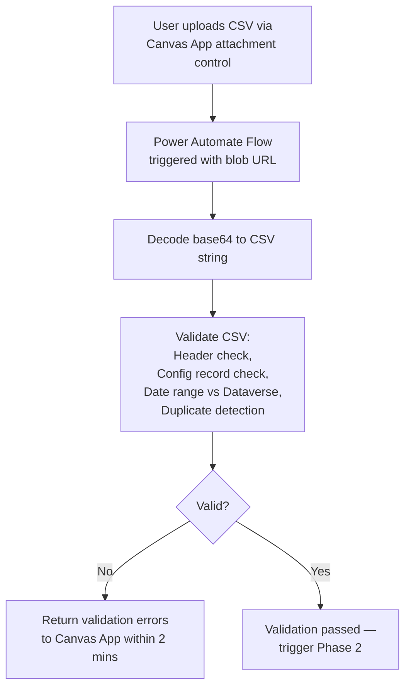
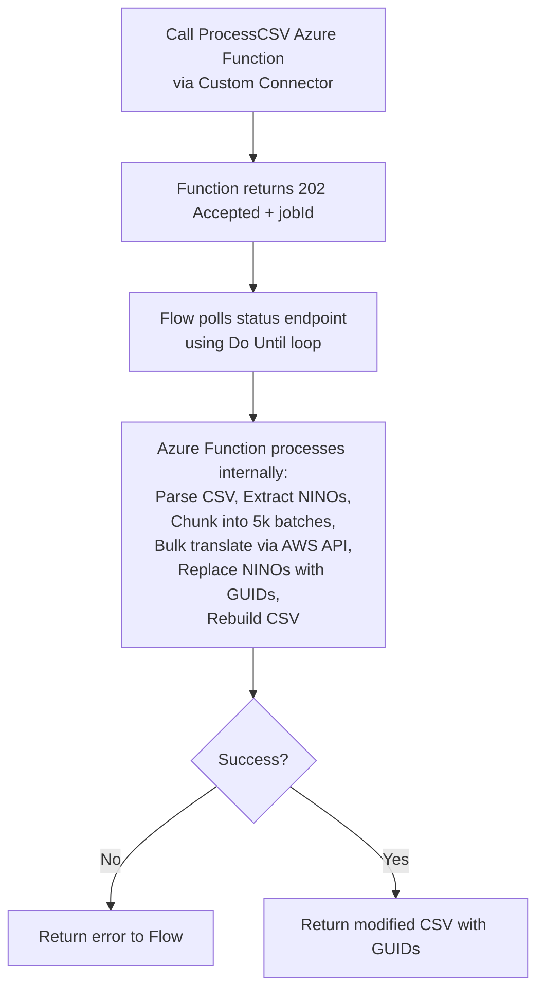
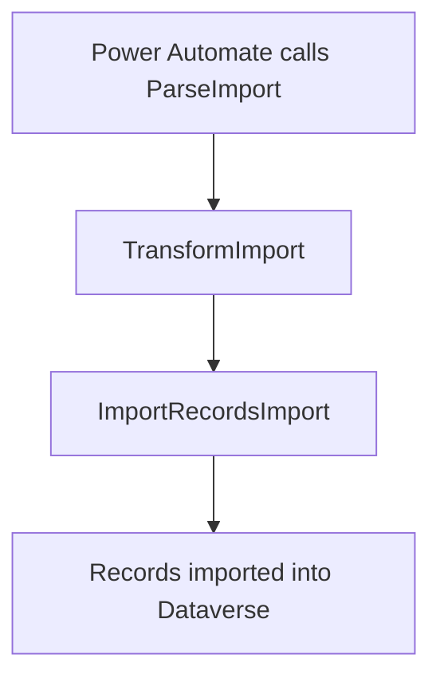
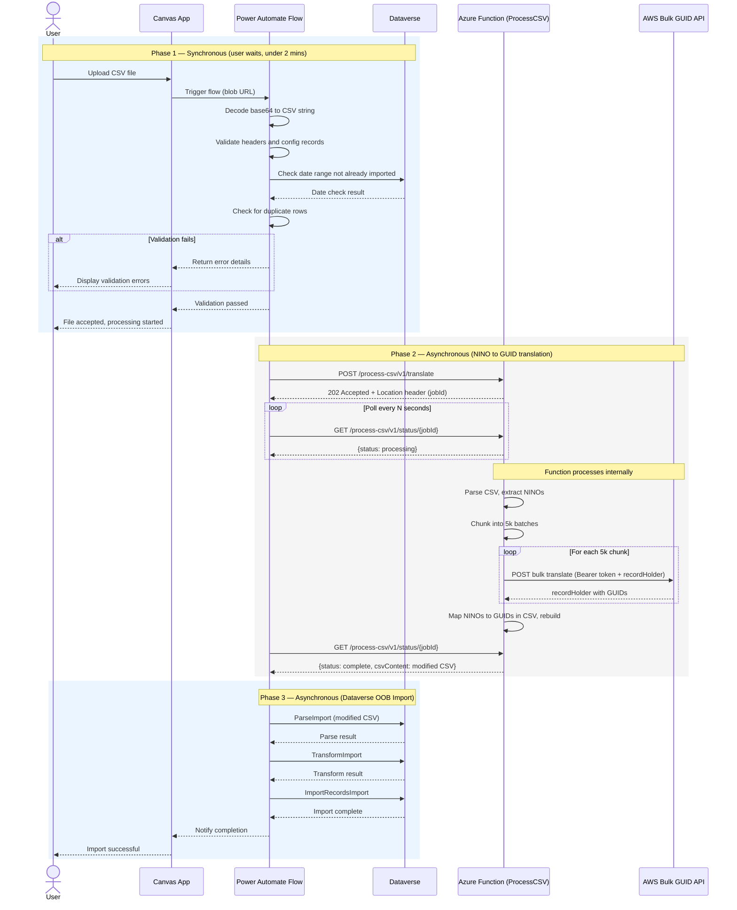
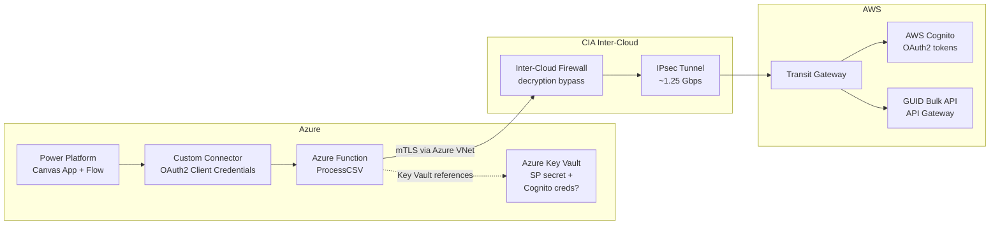

# GUID Service Integration — Proposal Overview

## Purpose

This document outlines the proposed approach for integrating with the DWP GUID Translation Service from the Power Platform. The GUID service translates between National Insurance Numbers (NINOs) and DWP GUIDs, allowing the system to work with GUIDs internally while exchanging NINOs with external data sources.

There are two distinct use cases:

| Use Case | Trigger | Volume | API Used |
|----------|---------|--------|----------|
| **Bulk Data Import** | User uploads a CSV file via the Canvas App | Up to 50,000 records per file | Bulk Translation API |
| **Case Assurance View** | Case assurance officer opens a record | Single record per view | Single Lookup API |

## Use Case 1: Bulk Data Import

When a user uploads a CSV file containing NINOs, the system needs to translate every NINO into a DWP GUID before importing the data into Dataverse. This is a three-phase process.

### Phase 1 — File Validation (Synchronous)

The user uploads a CSV file through the Canvas App. The system immediately validates the file and returns the result to the user **within approximately 2 minutes**. This means the user knows straight away whether their file is accepted or rejected.

Validation checks include:

- CSV headers match the expected format
- Configuration records are present and correct
- Date ranges in the file have not already been imported
- No duplicate rows within the file

If validation fails, the user sees a clear error message and can correct and re-upload.

### Phase 2 — NINO to GUID Translation (Asynchronous)

Once validation passes, the file is handed off to an Azure Function for processing. The user does not need to wait — they are notified that processing has started.

The Azure Function:

- Extracts all NINOs from the specified column
- Splits them into batches of 5,000
- Calls the DWP Bulk GUID Translation API for each batch
- Replaces every NINO with the corresponding DWP GUID
- Returns the modified CSV with GUIDs in place of NINOs

This runs in Python on Azure, which can process 50,000 records in a fraction of the time it would take using Power Automate loops.

### Phase 3 — Data Import (Asynchronous)

The modified CSV (now containing GUIDs instead of NINOs) is fed into the standard Dataverse import pipeline using the out-of-the-box import actions:

- **ParseImport** — parses the CSV structure
- **TransformImport** — maps columns to Dataverse fields
- **ImportRecordsImport** — creates the records in Dataverse

This leverages proven, supported Dataverse functionality rather than custom record creation logic.

### Phase 1 Validation

### Phase 2 Translation

### Phase 3 Import

### Detailed Interaction Flow

## Use Case 2: Case Assurance View (Single Lookup)

When a case assurance officer opens a case assurance record, the system makes a single call to the GUID Translation Service to retrieve the corresponding NINO for display purposes.

**Key points:**

- Only **one API call** is made per record view
- The NINO is held **in memory only** — it is displayed to the officer but **not committed to the database**
- This ensures NINOs are never stored in Dataverse, maintaining the security principle that only GUIDs are persisted
- The existing single-lookup Azure Function proxy handles this call

## Cross-Cloud Architecture

All calls to the GUID Translation Service travel from Azure to AWS via a secure cross-cloud connection.

**Key components:**

- **Power Platform** connects to the Azure Function via a custom connector secured with OAuth2 (service principal)
- **Azure Function** handles all authentication with AWS (Cognito OAuth2 client credentials) — this complexity is hidden from the Power Platform
- **Azure Key Vault** stores secrets securely (service principal credentials and potentially Cognito credentials)
- **CIA Inter-Cloud firewall and IPsec tunnel** provide the secure network path between Azure and AWS
- **mTLS** is used end-to-end, requiring decryption bypass on the Inter-Cloud firewalls

## Why This Approach

| Consideration | Our Approach | Alternative (Pure Power Automate) |
|---------------|-------------|-----------------------------------|
| **50k row processing speed** | Seconds (Python in Azure Function) | Hours (Power Automate Apply to Each loops) |
| **User feedback on validation** | Immediate (synchronous, under 2 mins) | Same |
| **NINO security** | NINOs never stored in Dataverse | Same |
| **Data import** | Standard Dataverse OOB import actions | Custom record creation or same |
| **Maintainability** | Processing logic in Python (testable, version controlled) | Processing logic in Flow actions (harder to test) |
| **Scalability** | Azure Function scales automatically | Constrained by Power Automate concurrency limits |

## Open Decisions

- **Cognito credential storage**: Whether the AWS Cognito credentials (used by the Azure Function to authenticate with the GUID API) are stored in AWS Secrets Manager (current) or Azure Key Vault (under discussion). This does not affect the overall architecture — only where the Function retrieves its credentials from.

## Next Steps

1. Confirm Cognito credential storage location
2. Confirm service principal details for Power Platform to Azure Function auth
3. Build and test the ProcessCSV Azure Function
4. Update the custom connector with new operations
5. Build the Power Automate flow (validation + orchestration)
6. End-to-end testing with realistic data volumes
